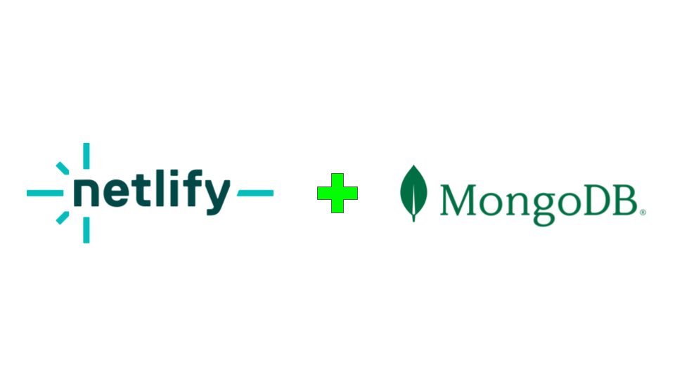

# Netlify and MongoDB Starter template

This is a template for integrating MongoDB Atlas with a Netlify site using serverless functions.



[](https://app.netlify.com/start/deploy?repository=https://github.com/mongodb-developer/netlify-mongodb-starter)

[](https://github.com/mongodb-developer/netlify-mongodb-starter/actions/workflows/main.yml)

## Setup

1. Clone this repository.
2. Install dependencies with `npm install`.
3. Set up your MongoDB Atlas database and get your URI. (Verify IP access is appropriate for your website IP)
   - You will need to setup the needed envioronment variables in `.env.local` or your site secrets:
```
 MONGODB_URI = "<YOUR MONGODB | MONGODB ATLAS URI>"
 MONGODB_DATABASE = "tasks_netlify"
 MONGODB_COLLECTION = "tasks"
```
5. Configure your environment variables in `netlify.toml`.
6. Run `netlify dev` to start your local server.

## Deploying to Netlify

### Set website secrets from .env.local
```
netlify env:import .env.local
```

Or use the Netlify ui ince web site is available and redeploy.

Click the deploy button above and connect to your website.
`-OR-`
Push this repository to your GitHub and link it to a new Netlify site. Set up environment variables in the Netlify UI.
